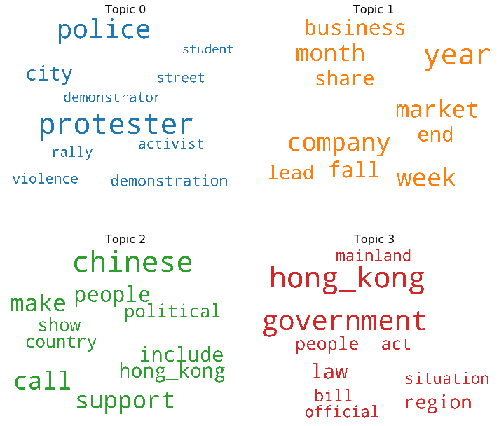
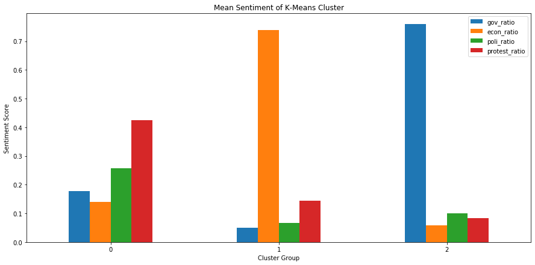
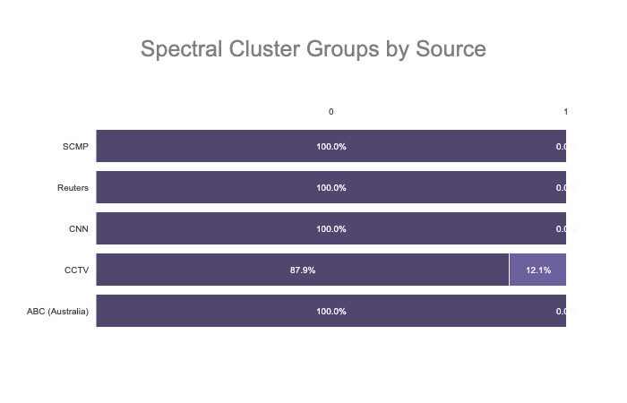
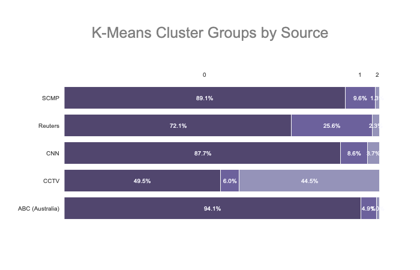

# Language in News
- Contributor: Wayne Lam
## The Project:
For the final project at Flatiron School topic modeling, sentiment analysis, and clustering was used in order to identify possible differences between news sources.  The idea was to measure how many topics were in each article (a most probable topic was assigned to each sentence using LDA Mallet), how strong was the language used in each sentence of those articles (sentiment analysis with VADER sentiment analysis), and then clustering of articles based on topics and sentiment attached to those topics.  News articles on the Hong Kong protests were scraped from the South China Morning Post (SCMP), the Australian Broadcast Corporation (ABC), Reuters, CNN, and CCTV (Chinese state news media).
- Dashboard: https://language-in-news.herokuapp.com/
- Accompanying GitHub page: https://github.com/wplam107/L_in_N
- Youtube Demo of Dashboard: https://youtu.be/uKPMpVUD-pk

## Major Takeaway:
- Based on a variety of clustering algorithms, the percentage of articles belonging to a particular cluster varies by news source indicating that how the news is portrayed varies by news sources

## The Data:
- Over 3000 initial articles were scraped
- Only the first 10 sentences of each article was used in order to limit the size differences of articles and to focus primarily on the "lede"
- After filtering articles in travel, business, op-ed, and fashion sections 1300+ articles were used as observations

## Initial EDA and Feature Engineering:
- Almost half of the articles were from SCMP and another quarter were from Reuters.  The remainder were from ABC, CNN, and CCTV.
- With LDA Mallet, the optimal number of topics based coherence scores (from the gensim CoherenceModel) was 4 topics without SCMP and 12 with SCMP.  The class imbalance appears to heavily skew optimal topic numbers toward the optimal number of topics for SCMP articles.  This is further compounded by the fact that SCMP is a local HK paper that may include a greater range of language and "topics" when reporting on the HK protests.  As a result, SCMP articles were dropped from the topic modeling portion (a sample of SCMP articles could have been taken as an alternative measure).
- The titles were manually labeled (from 0 to 3) as protests, economic, politics, government.  The following is a word cloud of the top words in each topic.  

- The absolute value of sentiment was measured (with VADER sentiment analysis) for each sentence (and as a result the topic of the sentence) in each article and a topic sentiment score was summed such that each article had a sentiment score for each of the 4 topics.
- The number of sentences about a particular topic was predictably correlated with the articles total sentiment score of a topic (a better measure may have been averaging the sentiment score instead of a sum) since more sentences about a topic will generate a larger sentiment score toward a particular topic.
- A quick glance at several sentences with the highest sentiment scores revealed that high sentiment scores may be correlated with sentences that are quotes.

## Clustering Models:
- PCA was used to reduce dimensionality from 17 features to 6 principal components (while retaining >95% of variance).
- Clustering algorithms were used to group articles based on similarity.  After exhausting all out-of-the-box clustering models in sklearn K-Means Clustering (3 clusters) and Spectral Clustering (2 clusters) were used as comparisons (the 2 algorithms were top 3 in terms of silhoutte score).
- The following is a look at topic ratios of the average article in each K-means cluster

- Below is a comparison of K-Means Clustering and Spectral Clustering in terms of percentage of articles labeled in each cluster

## Conclusions and Notes:
- There was a difference between sources in term of which clusters by source and topics by source (both with Chi-Squared values > 100)
- CCTV seems to standout with a lot of articles focusing on the "government" topic.  Reuters also had a more "economic" lean in their reporting.
- Further steps that can be taken:
  - Sample SCMP articles for topic modeling
  - Remove VADER sentiment as a metric and focus on different topic models such as doc2vec for document embeddings by sentence
  - Remove sentences that are a part of quotes to constrain sentiment scores to statements made by the news outlet itself
  - Create a separate metric for number of quotes in an article by topic
  - Increase number of articles to include Chinese language news with the aid of TextBlob
  - Change sum of sentiment to average of sentiment
